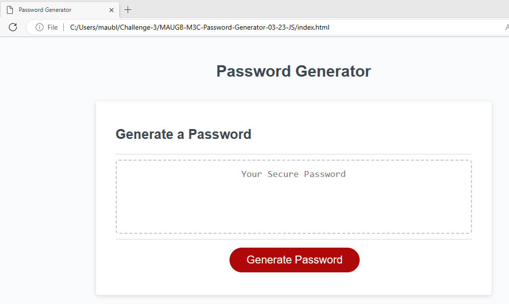
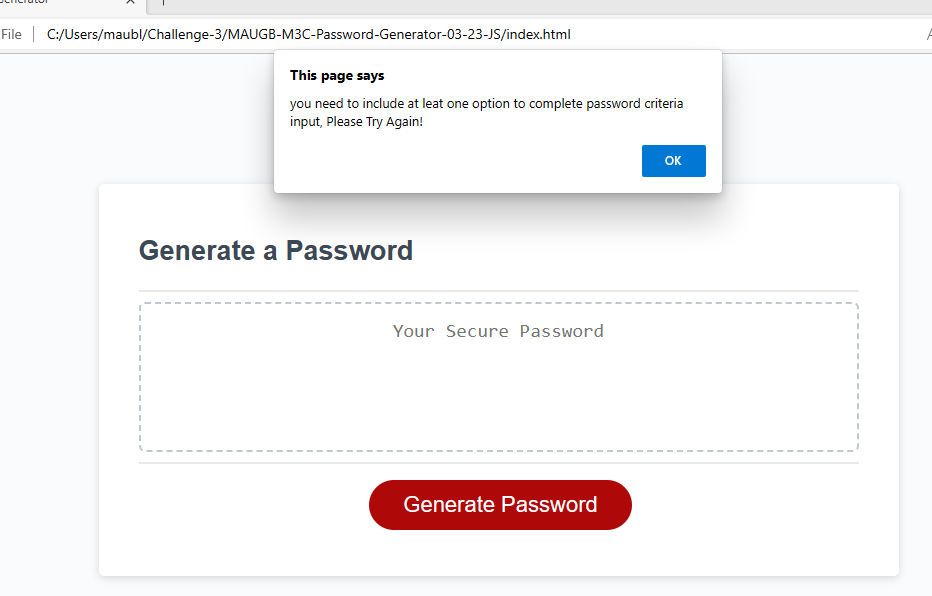
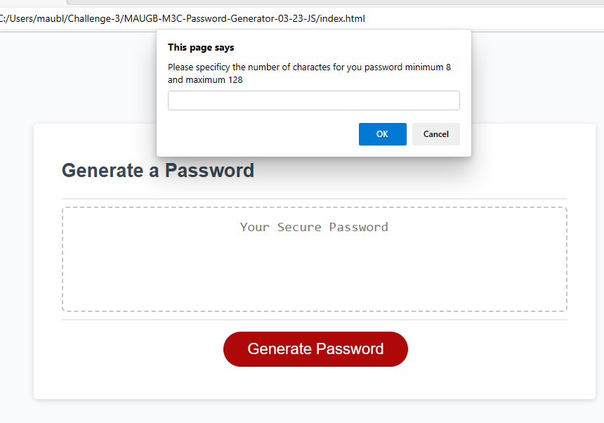
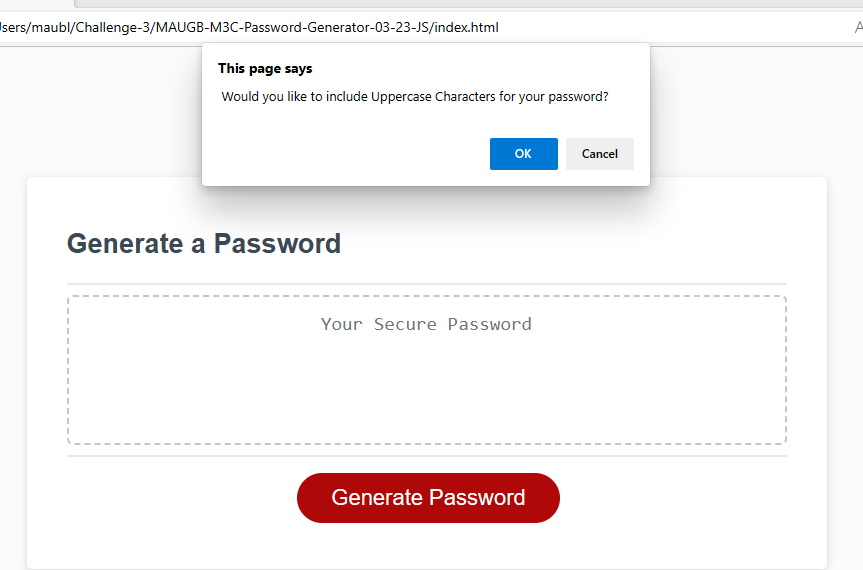
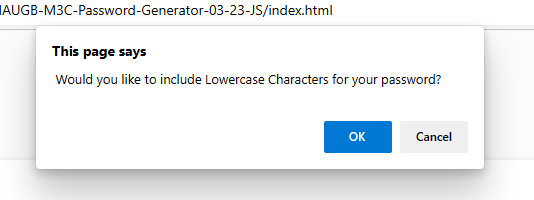
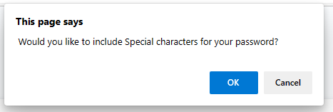
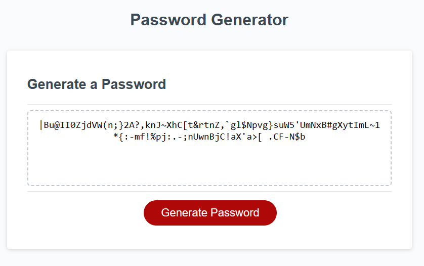
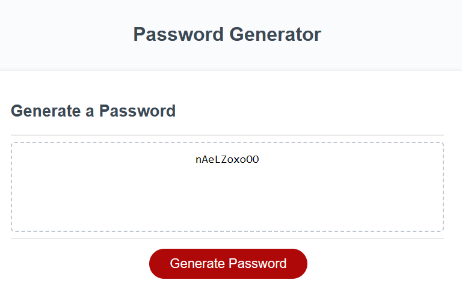
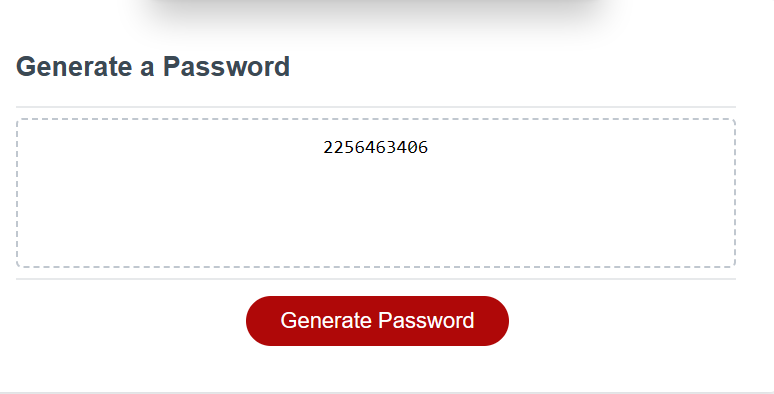

# Password Generator Starter Code

## Description

This is a password generator created using JavaScript code, HTML & CSS 
The password generator is a tool created to provide random passwords to the user.

This application defines a minimum range of 8 characters and maximum range of 128 characters.

The Password Generator can alternate different character using lowercase, uppercase, numbers and special characters; they can be randomly generated to achieve the maximum length provided by the user.

The application validates the input in case there are not values or lengths exceed the limit defined. For these cases an alert will prompt indicating to the user what information needs to select or entered in order to generate the password.

Used can get the new password in an easy and effective way.

Links to access the Pasword Generator Application:

Github repository:
 https://github.com/MauricioGB1/MAUGB-M3C-Password-Generator-03-23-JS

Link to Website application:
 https://mauriciogb1.github.io/MAUGB-M3C-Password-Generator-03-23-JS/

## Table of Contents (Optional)

- [Installation] Application runs using the link and runs on the browser. No installation is required.
- [Usage] Application runs in multiple browsers Chrome, Firefox, Edge, Safari. 
- [Credits]Software and support provided by RICE University.
- [License]License by MIT.

## Installation

What are the steps required to install your project? Provide a step-by-step description of how to get the development environment running.

## Usage

Application can be use to generate passwords betwee 8 to 128 charactes

If user selections do not meet criterial an alert will be showed on the scree:

Password length should be minimum 8 to 128 maximum characters:

Examples of the input characters, lowercase, uppercase, special characters and numbers can be selected as options for the password generation:

Examples of passwords generated:

## Credits

Support provided by Rice University.

## License

This application runs under MIT License

